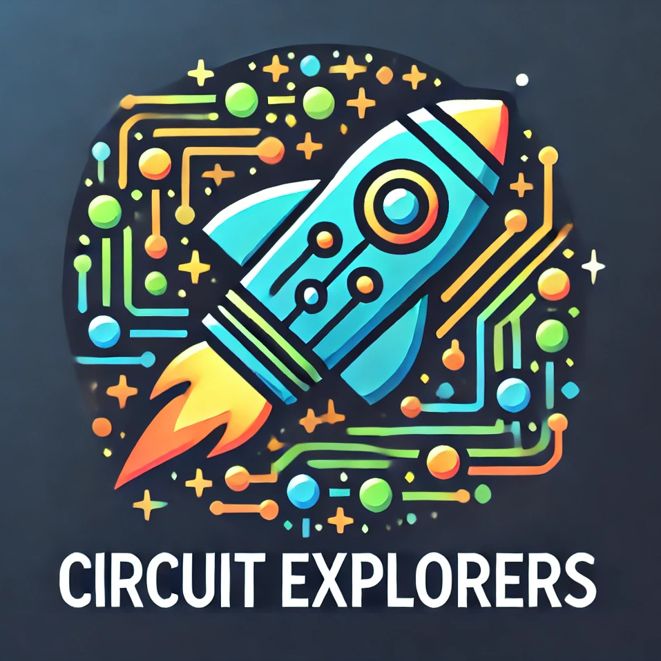

    

Welcome to **Circuit Explorers**, a hands-on tutorial on exploring, designing,
simulating, building, and testing digital circuits.

🎯 **Goal:** To build a full-featured, programmable 8-bit computer using only
chips in the [74LS family of integrated circuits](https://en.wikipedia.org/wiki/List_of_7400-series_integrated_circuits).

📈 **Journey:** Circuit Explorers aims to be an educational journey where you
start from zero knowledge of electronics to learn about analog and digital
circuits via a set of **Adventures**, and eventually build your every own
programmable CPU from scratch.

Each adventure redirects you to curated documentation and video tutorials so
you can quickly understand the basic concepts, and encourages you to experiment
both by simulating circuits on your computer, and by building physical circuits
to test them yourself.

This is the repository where development for the public
[Circuit Explorers website](https://vkoukis.github.io/circuit-explorers) happens.

## Development

🚧 🚧 🚧 This is Work-in-Progress 🚧 🚧 🚧

## Contact

For all comments, bug reports, suggestions for improvements, please contact:

* Vangelis Koukis &lt;vkoukis@gmail.com&gt;

Looking forward to hearing from you!

## License

The documentation in this repository is licensed under the [Creative Commons
Attribution-ShareAlike 4.0 International
license](https://creativecommons.org/licenses/by-sa/4.0/).

The code in this repository is licensed under the [Apache
2.0](https://www.apache.org/licenses/LICENSE-2.0) license.
