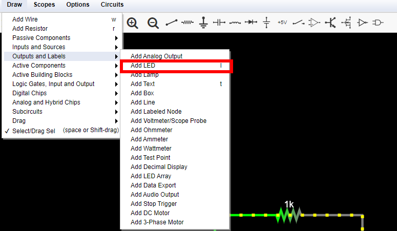
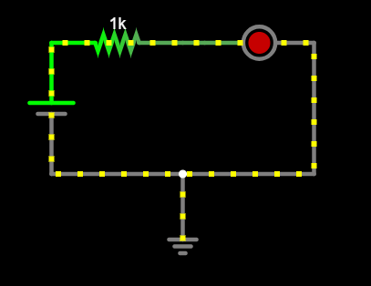
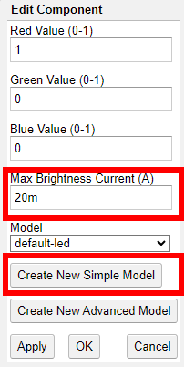

# Adventure 2a: Light an LED

## Goal

Understand **how Light-Emitting Diodes (LEDs)** work.
Simulate a circuit where we use a voltage source to light an LED. Then, build
it on a breadboard, to light the LED.

## Simulate circuit

1. Watch this short [video on how LEDs
   work](https://www.youtube.com/shorts/CIMbjJQNHa0).

2. Note your LEDs specify a **voltage range**, e.g., $2.0V - 2.5V$, and a
   current specification, e.g., $20mA$. This means the LED requires the voltage
   across its terminals to be within $2.0V - 2.5V$, and the current flowing
   through it will be $20mA$ when the voltage is at this range.

3. How much voltage does our voltage source supply? Why can't we just connect
   the LED directly to our voltage source?

   :::{admonition} Answer
   :class: hint
   :class: dropdown
   Our voltage source supplies about $5V$. The LED requires $2.0V - 2.5V$
   so we cannot connect it to the voltage source directly. Doing so would
   destroy the LED.
   :::

   :::{warning}
   Never connect the LED directly to a voltage source outside its voltage
   range. Watch this video by Ben Eater where he demonstrates how [too much
   voltage destroys the
   LED](https://www.youtube.com/watch?v=poWJTSV4Yio&list=PLowKtXNTBypETld5oX1ZMI-LYoA2LWi8D).
   :::

1. Remember how connecting multiple resistors in series in
    **reduces the current** that flows through
   the circuit. Also note connecting multiple resistors in series **divides the
   input voltage** between them. How can we limit the voltage across the LED
   and the amount of current that flows through the LED?

   :::{admonition} Answer
   :class: hint
   :class: dropdown
   We will connect a resistor *in series* with the LED, to limit the voltage
   across its terminals.
   :::

1. Open [Circuit Simulator](https://falstad.com/circuit/circuitjs.html) and
   load the circuit from .
   Here is an example of the finished circuit: [Circuit - Ohm's
   law](https://falstad.com/circuit/circuitjs.html?ctz=CQAgjCAMB0l3BWcMBMcUHYMGZIA4UA2ATmIxAUgoqoQFMBaMMAKADcRD8QAWHvTt2wIUUMT1piqMBCwBOggcNF44IZWLDwWAcxAZIPXv32HexQlJYB3EKqob7xgZBuLnpo3xduDXk07eUCxAA).

1. Click **Draw --> Outputs and Labels --> Add LED** to add a new LED to
   your circuit. Here is a screenshot to help you find the menu entry, also
   note you can use keyboard shortcut `l`:
   

   Add the LED **in series** with the existing resistor in your circuit.
   Note the LED has specific **polarity**. One terminal is the positive
   terminal, or **anode (+)**, one terminal is the negative terminal, or
   **cathode (-)**. The LED is a **diode**, so it allows current to flow in a
   single direction, from the anode to the cathode. The symbol for a diode
   look like an arrow pointing in the direction of current flow:
   

   After adding the LED, your circuit should look like this:
   

1. Double click the LED and edit it to specify the right value for **Max
   Brightness Current** according to your own LEDs, for example $20mA$.
   Then, click `Create New Simple Model` and change **Forward Voltage** to
   match the maximum voltage of your LED, for example $2.5V$.

   

1. Ensure the resistor is $1kΩ$. Hover your mouse over the LED. How much
   current flows through it, how much is the voltage drop around it? Is the
   current and voltage inside the right range for your LED? Does it produce a
   bright light?

   :::{admonition} Answer
   :class: hint
   :class: dropdown
   The current is lower than it should, $3.1mA$ and the voltage is outside the
   right range, at $1.88V$. The LED only produces a dim light.
   :::

1. Edit the resistor and play with different resistance values. What happens
   to the current that flows through the circuit depending on the resistance?
   What resistor should you use for your LED?

   :::{admonition} Answer
   :class: hint
   :class: dropdown
   Increasing the resistance decreases the current even more. Decreasing the
   resistance increases the current and the voltage across the LED. A good
   value seems is $150Ω$. In this case, the current is $19.5mA$ and the voltage
   across the LED is $2.07V$, both within range. So, we can use a $150Ω$
   resistor.

   If you would like some help with creating the circuit, see below.

   :::hint
   :class: dropdown
   Here is an example of the finished circuit: [Circuit - Light an LED](https://falstad.com/circuit/circuitjs.html?ctz=CQAgjCAMB0l3BWcMBMcUHYMGZIA4UA2ATmIxAUgoqoQFMBaMMAKADcRD8QAWHvTt2wIUUMT1piqMBCwBOggcNEZIPEMrFhKLAOYhV6vgMO9ihKSwDuIPHA0jb941GuLe-A2o8DIb0y52VC5+2OoAZlYAJnIA9gAOADoAjijQSBDE0NgojMzi0GB4PMSQCGCQYDwIGMSOVKxghCpoDqJBbSCikTEJKWkZUlCwKP6tmqaafkA).
   :::

1. We found the right resistor to use by trying different resistance values.
   Can we **calculate** the right resistance? We know the operating parameters
   of the LED: voltage must be $2.0 - 2.5V$, in which case the current is
   $20mA$. Can you calculate the right resistance using **Ohm's law**?

   :::{tip}
   An LED itself does not follow Ohm's law. It is not a resistor, we cannot
   use Ohm's law on it. But we can use Ohm's low on the resistor we connect
   in series with it, to limit its current. We know the current, and we know
   how much we want the voltage across the LED to be. In
    we saw that connecting two resistors in
   series divides the input voltage between them. This holds for all kinds
   of components: the voltage across the resistor and the voltage across the
   LED add up to the input voltage.
   :::

   :::{admonition Answer
   :class: hint
   :class: dropdown
   In  we saw that connecting two resistors
   in series divides the voltage between them. Let's call $V_R$ the voltage
   across the resistor, $V_L$ the voltage across the LED, and $V_T$ the
   total voltage:
   $$ V_T = V_R + V_L $$

   We know we want the voltage on the LED to be between $2.0V - 2.5V$, so let's
   choose $V_L = 2.0V$ to be on the safe side. We also know $V_T = 5V$, because
   this is our power supply. In this case the voltage across the resistor will
   be:
   $$ V_R = V_T - V_L = 5V - 2V = 3V $$

   To calculate the resistance we need, we also need to know the **current**
   we want to flow through the resistor. We know the current flowing through
   the LED should be **20mA**, and our components are connected in series,
   so the current flowing through the resistor is $I_R = 20mA$.

   We can know use Ohm's law to compute the resistance:
   $$ R = {V_R \over I_R} = {3V \over 20mA} = {3V \over {20 \cdot 10^{-3}mA}}
   = {3000V \over 20A} = 150Ω$$.

   This agrees with the results of our simulation, so let's build it!

## Build circuit

Grab your breadboard! Start from the original circuit you had built for
:

1. Make sure your circuit is powered off, disconnect the DC power cable from
   the round DC power plug.

1. Use an $150Ω$ resistor in series with the LED.

1. Add your LED **in series** with the resistor. Note the long leg is the
**anode, (+)**, so place it towards VCC, and the short leg is the **cathode,
(-)**, so place it towards GND.

   :::{danger}
   Do not connect the LED directly to VCC and GND, you **have** to include a
   current-limiting resistor in between, to protect the LED.
   :::

1. Confirm everything looks good, then power on your circuit, your LED should
   shine bright! If it doesn't, power off your circuit immediately, and go over
   your circuit again, to ensure everything looks good.

1. Connect your multimeter in series and measure the current flowing around
   the circuit, $I$. Write down this current. It should be close to the
   expected value. Example measurement: $I = 20.4mA$.

1. How much do you expect the voltage drop around the resistor to be?
   Use your multimeter to measure it. Write down your measurement, and compare
   it with what you expected.

   :::{admonition} Answer
   We expect the voltage drop to be $V = IR \approx 3V$, based on Ohm's law
   and our chosen resistance. Example measurement: $3.02V$. This is very close
   to our expected value.
   :::

1. Measure the supply voltage. How much do you expect the voltage drop across
   the LED to be?

   :::{admonition} Answer
   It should be the difference between the supply voltage and the
   voltage measured drop across the resistor, for example $5.11V - 3.02V$ =
   $2.09V$, which is in the right range for our LED.

1. Does it make a difference if the resistor sits between VCC and the anode
   of the LED, or if it sits between the cathode of the LED and GND?

   :::{admonition} Answer
   No, because the current flowing through the LED and its voltage is the
   same.
   :::

1. Add a momentary switch (push button) in series with the LED. Use the
   multimeter to find out what each pin does, set it to "Ω - 🎵" mode.
   Push the button to turn on the LED at will.

1. Replace the momentary switch a small "Single Pole - Double Throw" (SPDT)
   switch, in series with the LED. Use the multimeter to find out what each
   pin does, set it to "Ω - 🎵" mode. Flip the switch to turn the LED on and
   off at will.

## Celebrate

Congratulations! You've simulated and built a circuit to light an LED, using
a resistor to limit the current that flows through it.

Here are more challenges to explore, as you prepare to embark on your next
adventure.

* The switch is a *double throw* switch. Design, simulate, and build a circuit
  with two LEDs: One of the two LEDs should always be on, and you can choose
  which one of the two LEDs to light based on the position of the switch.

  :::{Important}
  Pay attention to the *polarity* of the LEDs.
  :::

Here are more resources to explore:

:::{see also}
* [Ben Eater: Limiting current through an LED](https://www.youtube.com/watch?v=CdqvY_vY1XA&list=PLowKtXNTBypETld5oX1ZMI-LYoA2LWi8D&index=2)
* [Wikipedia: Diode](https://en.wikipedia.org/wiki/Diode)
* [Wikipedia: LED circuit](https://en.wikipedia.org/wiki/LED_circuit)
* [Wkipedia: Light-emitting diod](https://en.wikipedia.org/wiki/Light-emitting_diode)
:::
