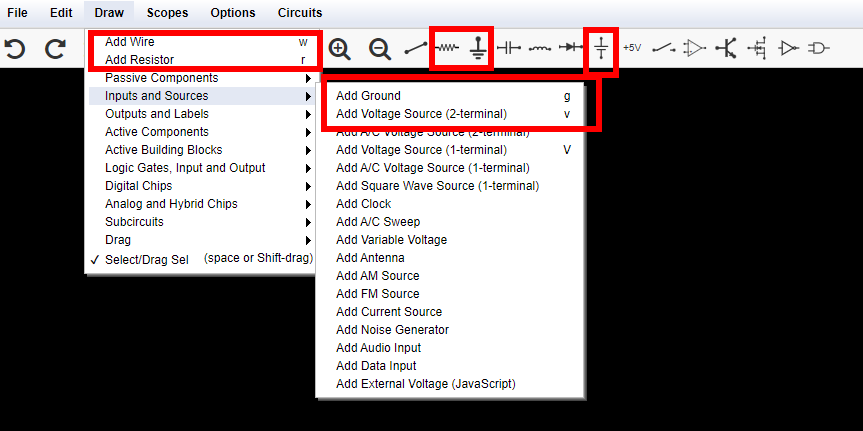
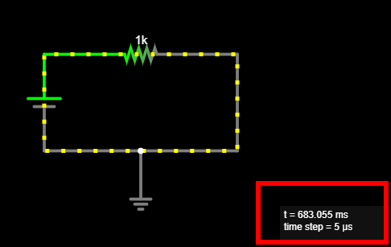
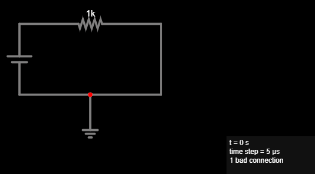
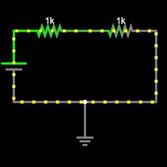
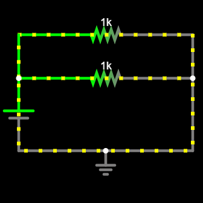

# Adventure 0: Ohm's Law

## Goal

Design your first circuit. First, simulate it on your computer. Then, create it
on a breadboard.

Understand **Ohm's law** and experiment with different electrical components.

## Simulate circuit

We will use an interactive circuit simulator running inside your browser to
simulate a simple circuit. It was written by [Paul
Falstad](https://github.com/pfalstad/) and enhanced by [Iain
Sharp](https://github.com/sharpie7).

Watch this [video tutorial on Circuit
Simulator](https://www.youtube.com/watch?v=_qOYj3onHAw) as an introduction to
how it works.

1. Navigate to [Circuit Simulator](https://falstad.com/circuit/circuitjs.html).
   Notice the application will open in a new tab in your browser. Drag the tab
   out into its own window, so you can have these instructions and the Circuit
   simulator open side-by-side.
1. To concentrate on your circuits, press F11 to switch fullscreen mode on and
   off.
1. Click **File --> New Blank Circuit** to start with a new blank circuit.
1. Add a voltage source, a resistor, and a ground wire to your circuit. Connect
   them with wires. Here is a screenshot that can help you find the tools you
   will need:

   

   At this point your circuit should look something like this:

   

   :::{tip}
   Notice the mouse cursor changes when you are ready to draw a new component,
   compared to when you are moving components around. Use the **Esc** key to
   stop drawing components.
   :::

1. Click the **RUN / Stop** button to start the simulation, and see the current
   flow!

   :::{important}

   Make sure Circuit Simulator reports no **bad connection**. Circuit Simulators
   highlights bad connections using **red dots**.

   Here is an example, where I thought the ground was connected to the wire,
   but it was not, it was floating instead. Notice the red dot and how the
   simulator reports `1 bad connection`:

   

   To fix this, and establish a connection to the ground:
   1. Hover over the single wire and press `Del` to delete it.
   2. Add a new wire for the left part of the original wire.
   3. Add a new wire for the right part of the original wire.

   **Alternatively**, you can split the wire at the point where you want to
   connect your ground. This is a more advanced operation:
   1. Hover your mouse over the wire, so it is selected.
   2. Move the mouse cursor close to the red dot, but not *on* the red dot.
   3. Hold down the **Ctrl** key and click, so you split the wire at this
      point, and a new node appears where it connects with ground.
   :::

   If you would like some help with creating the circuit, see below.

   :::{hint}
   :class: dropdown
   Here is an example of the finished circuit: [Circuit - Ohm's law](https://falstad.com/circuit/circuitjs.html?ctz=CQAgjCAMB0l3BWcMBMcUHYMGZIA4UA2ATmIxAUgoqoQFMBaMMAKADcRD8QAWHvTt2wIUUMT1piqMBCwBOggcNF44IZWLDwWAcxAZIPXv32HexQlJYB3EKqob7xgZBuLnpo3xduDXk07eUCxAA).
   :::

1. Explore: Change your circuit, move things around, delete components and
   re-add them.

   :::{tip}
   * If you make a mistake, use Ctrl-Z to undo.
   * Hover your mouse over the different selections in the UI, a tooltip will
     appear.
   * Notice there are useful *keyboard shortcuts* for all components you need
     to add. For example press **r** to insert a new resistor. Explore to find
     more!
   * Click **Edit --> Center Circuit** to center your circuit. Also find
     commands to zoom in and out of your circuit in the **Edit** menu.
   * If you close your browser window by mistake, use **File --> Recover
     Auto-Save** to bring back your latest work.
   :::

   <!-- See https://myst-parser.readthedocs.io/en/latest/syntax/admonitions.html#collapsible-admonitions -->

1. Notice the current flows around your circuit, through the resistor.
   Hover your mouse over the resistor, and notice the values shown inside
   the box on the lower-right corner. Notice the resistance of this component,
   it's $R = 1kΩ$. Notice the value for the **current** flowing through the
   resistor. $I = 5mA$. Notice the value for the **voltage drop** around the
   resistor, it's $V_d = 5V$.

1. Double click the voltage source and change its voltage to `10`, i.e., $10V$.
   Hover over the resistor again, how much is the current flowing through
   the circuit now?

   :::{admonition} Answer
   :class: hint
   :class: dropdown
   Notice it is *double*, $I = 10mA$. Double the voltage, double the current,
   when resistance remains constant.
   :::

1. Double click the resistor and double the resistance, set it to $2kΩ$. What
   happens to the current that flows through the circuit? Compare to its
   previous value, when the resistance was $1kΩ$, we have now doubled the
   resistance.

   :::{admonition} Answer
   :class: hint
   :class: dropdown
    Notice the current is *half*. It used to be $10mA$, now it is
    $I = 5mA$ again. *Double* the resistance, *half* the current, when voltage
    remains constant.
   :::

1. Notice the current flowing through the circuit depends on the voltage of the
   source and the resistance of the resistor.

   :::{important}
   **Ohm's law** determines how much current flows through a resistor:
   $$I = {V \over R}$$

   This means that for each resistor we can always find one of $I$, $V$, or
   $R$, if we know the other two:

   $$
   I = {V \over R} \qquad R = {V \over I} \qquad V = I \times R
   $$

   :::{note}
   Ohm's law only applies to *ideal* resistors, which we also call *resistive*,
   or *ohmic* loads. We will see there are other types of loads, like diodes,
   and capacitors, later on.
   :::

1. Double click the voltage source, make sure it's set to $5V$. What should the
   resistance be to have a current of $I = 25mA$ flow through the circuit? Use
   Ohm's law to compute it.

   :::{admonition} Answer
   :class: hint
   :class: dropdown
   Let's use Ohm's law:
   $$
   R = {V \over I} = {5V \over 25mA} = {5 \over {25 \cdot 10^{-3}}} =
   {5000V \over 25A} = 200Ω
   $$
   :::

1. Set the resistor's value to the one you just computed. How much current
   flows through the circuit?

1. Hover over different **wires**. Notice the same current, $I$ flows through
   every part of the circuit. Notice the voltage drop is zero, $V_d = 0$.

   :::{tip}
   Wires are *ideal* and have zero resistance. Their length does not matter,
   their resistance is always $R = 0$, so the voltage drop around them is
   always $V_d = 0$.
   :::

1. Hover over different **nodes** in the circuit. How much is the voltage at
   the two ends of the resistor?

   :::{admonition} Answer
   :class: hint
   :class: dropdown
   Notice one end is at $5V$, because it is connected to the long end of the
   voltage source -- the *positive* end -- and one end is at $0V$, because it
   is connected to ground.
   :::

1. Experiment with different values of $V$ and $R$ for the voltage source and
   resistor, respectively. Confirm Ohm's law applies.

1. **Save** your work: Click **File --> Save As...**, name your file, and click
   **OK** to download it. Later on, use **File --> Open File...** to load
   your saved circuit.

   :::{tip}
   If you close your browser window without having saved your work, remember
   you can always click **File --> Recover Auto-Save** to return to your
   latest circuit.
   :::

## Build circuit

Grab your breadboard! It's time to build the actual circuit, and use a
multimeter to measure voltages and currents:

1. Observe your breadboard. Notice it has holes arranged in columns and rows.
   The holes are all connected in a specific pattern, watch this [video on how
   breadboard works](https://www.youtube.com/shorts/QKsVPHKTNOw) to understand
   more.

1. Take your multimeter and set it to the 🎵 position. Touch the probes
   together, confirm that the meter beeps. This means there it detects an
   electrical connection between the two probes -- very small resistance.

1. Test different pairs of holes using your multimeter. When does it beep, and
   why?

   :::{hint}
   Use the probe wires with crocodile clips at the end and clip them on small
   wires, so you can put them in the holes of the breadboard.
   Here is an example video by Science Buddies on [how to use crocodile
   clips](https://www.youtube.com/shorts/_-MgadRc83I) with your multimeter.
   :::

1. Set your multimeter to **Ω - 200** or a similar range. This means it can
   measure resistors up to $200Ω$. Take a $150Ω$ resistor and place the red and
   black probe at the two ends of the resistor to measure it. Watch this example
   video by Science Buddies on how to [measure resistance with a
   multimeter](https://www.youtube.com/shorts/LwmtPzRk9yY). What value does the
   multimeter show? Why is it not exactly $150Ω$?

   :::{admonition} Answer
   :class: hint
   :class: dropdown
   No component is ideal in the real world. Resistors are built with
   *tolerance*. Also, resistance depends on environmental factors, e.g.,
   ambient temperature.
   :::

1. Take a **DC chassis connector [5.50mm x 2.1mm]**, it should look similar to
   [this
   one](https://www.fanos.gr/en-gb/connectors/dc-connectors/dc-connector-5-5-x-2-1mm-html).
   Find out which pins correspond to the round part and the pin of the barrel
   plug. Connect two small wires at each pin, so you can then insert them in
   the breadboard. Insert the wire that corresponds to the pin in the **(+)**
   bar, and the wire that corresponds to the round part in the **(-)** bar. The
   (+) bar will be your "VCC" [supply voltage], the (-) bar will be your GND
   [ground].

1. Take a **USB charger** and connect it to your wall outlet. Take a **USB A
   --> DC 5.50 x 2.10mm cable** -- it should look similar to [this
   one](https://www.skroutz.gr/s/24015538/Powertech-USB-2-0-Cable-USB-A-male-DC-5-5x2-5mm-Mayro-1-5m-CAB-U121.html)
   -- and use it to connect the USB charger with the chassis connector on your
   breadboard.

   :::{danger}
   **NEVER** connect anything else to your wall outlet *except* the USB
   charger. Wall outlets supply **extremely dangerous** voltages, $110V$ or
   $220V$.
   :::

1. Set your multimeter to "V - 20V" or a similar range. Measure voltage across
   the breadboard. Watch this example video by Science Buddies on how to [measure
   voltage with a multimeter](https://www.youtube.com/watch?v=glVID_skJFQ). How
   much voltage does the USB charger supply to your breadboard? Ensure you are
   measuring around $5V$. Note down this value. Why is it not exactly $5.00V$?

   :::{admonition} Answer
   :class: hint
   :class: dropdown
   No component is ideal in the real world. Voltage sources do not supply a
   constant voltage, their voltage actually depends on the current that flows
   through the circuit, and other factors.
   :::

1. The polarity -- the sign of the measurement -- is important! Make sure to
   place the red lead on (+), the black lead on (-). What happens if you
   reverse them?

1. Build your circuit. Choose a resistor around $150Ω$, and connect between the
   VCC and GND bars. Current is now flowing through the resistor! How much
   current do you expect is now flowing? Use Ohm's law to compute it.

1. Measure this current. Connect your multimeter *in series* with the resistor,
   that is between VCC and the resistor, or between the resistor and ground.
   Set it to "DC A - 200m" or similar. Watch this example video by Science
   Buddies on how to [measure current with a
   multimeter](https://www.youtube.com/shorts/fvofeRNyHCA). How much current do
   you measure? How does it compare to your estimate in the previous step?
   What happens if your reverse the probes?

   :::{caution}
   Make sure to *always* connect the multimeter **in series** with a resistor,
   never directly to a voltage source, to **limit the current** that will flow
   through it. Otherwise, you risk blowing the internal fuse of the multimeter.
   Your multimeter has an internal fuse which will blow if the current exceeds
   $500mA$.
   Watch this video by Science Buddies explaining [how to replace the
   fuse](https://youtu.be/xIjMYB_qNOI) of your multimeter for more information.
   :::

1. Measure the voltage between VCC and GND again. Is it the same as when no
   current was flowing through the circuit? Keep the multimeter connected, and
   connect and disconnect one leg of the resistor, to close and open the
   circuit. What do you notice?

   :::{admonition} Answer
   :class: hint
   :class: dropdown
   The voltage changes, because the USB charger is a real-world component,
   and not an ideal voltage source. It is slightly lower when current flows
   through the circuit.
   :::

## Celebrate

Congratulations! You've simulated and built your first circuit.
Here are more things to explore, as you prepare to embark on your next
adventure.

* What happens if you connect two resistors *in series*, one after the other?
  That is, you insert one more resistor *between* one leg of the existing
  resistor, and VCC or GND. Simulate the circuit and build it on your
  breadboard.

  Here is what your circuit should look like:

  

* What happens if you connect two resistors *in parallel*? That is, you insert
  one more resistor which touches exactly the same points as the existing
  resistor. They both connect to VCC and GND at the same time.

  Here is what your circuit should look like:

  

Here are more resources to explore:

:::{seealso}
* [Wikipedia: Voltage source](https://en.wikipedia.org/wiki/Voltage_source)
* [Wikipedia: Ohm's law](https://en.wikipedia.org/wiki/Ohm%27s_law)

* [GitHub repository for Circuit Simulator](https://github.com/pfalstad/circuitjs1)
* [Iain Sharp's page on Circuit Simulator](https://lushprojects.com/circuitjs/)

* [Science Buddies: How to Use a Multimeter](https://www.youtube.com/watch?v=ts0EVc9vXcs)
:::
